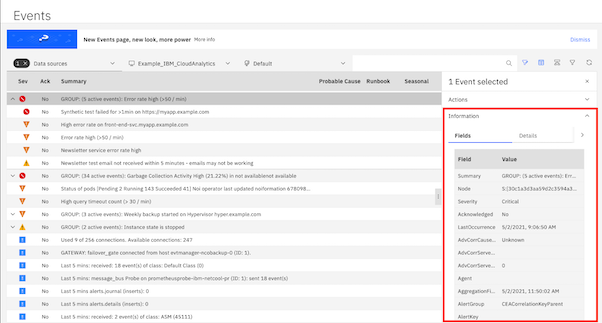

# Introduction

Event manager provides the industry leading advanced event correlation. It uses algorithms like association rule-learning, temporal, spatial clustering and other machine learning (ML) algorithms. It measures accuracy, chesion and completeness of the correlation. This, not only reduces the event flood, but also accelerates the incident diagnosis.

As part of this tutorial you will

* [Launch the console](#Launch-the-console)
* [Analytics based grouping of the events](#Analytics-based-grouping-of-the-events)
* [Further navigation tips ](#Further-navigation-tips )

## Launch the console

In the environment provided to you, in the desktop vm, launch the browser. Select the bookmark **EventManager-Console**.  

  

Use the credentials provided to you and select **Login** button.  
```
For example:
userid: user1
password: xxxxxxxxxx
```  
Once you login, you can navigate to the event viewer.  
  

## Analytics based grouping of the events

Click on the flag icon which is highlighted to launch the event viewer. **Note**: change the default to Default filter.  As your user is assigned **operator** role, you will not have the capability to edit the filters and edit the views. Those icons in the console are colored blue. 


By default, out of the box, example analytics is provided. This is named as **Example_IBM_CloudAnalytics**, listed in the toolbar. This analyzes the events and groups the events where the event rate is high ( greater than 50 per minute)
Note: **Document why the events are grouped**

You will notice the appearcance of  icon before the **Sev** column. This means that few events are grouped. You click it to display all the events that grouped, where the event rate is greater than 50 per min. 

  

You can view why the events are grouped together. Select the event which has **Group: ** in the summary column to display the information.   

  

## Further navigation tips  

You also can act on these events further. If you scroll from left to right, you will find where these 

1. **Search Events**: You will see events that are available in the system as your user-id is provided access to list all the events. Select and click on the search icon  and type **myapp.example.com**.  This will filter the events that match the string.  To remove the search filter you can click on **x** in the search field.

   

2. **Filter Events**: In the event viewer, you can filter the events by severity. You can use the funnel icon  to select what events you want to see.   
For example select **Critical** and **Major** events and select the **Apply filters**.   
  

Now you will notice it lists only the events which are **Critical** and **Major**.  To change the view, go back to the filter icon and unselect the previously selected events and apply the filter again.  

  

3. **View the event details**: Select the event row  which has Node name as front-end-svc.myapp.example.com. **Hint**: You can search for it as listed above. This will launch the **event details** where you can act upon. You can collapse **Actions** and expand Information to view the event fields with values. You can scroll down to see the various fields with the corresponding values.    

  


