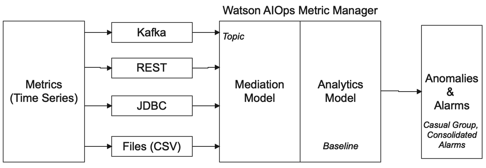
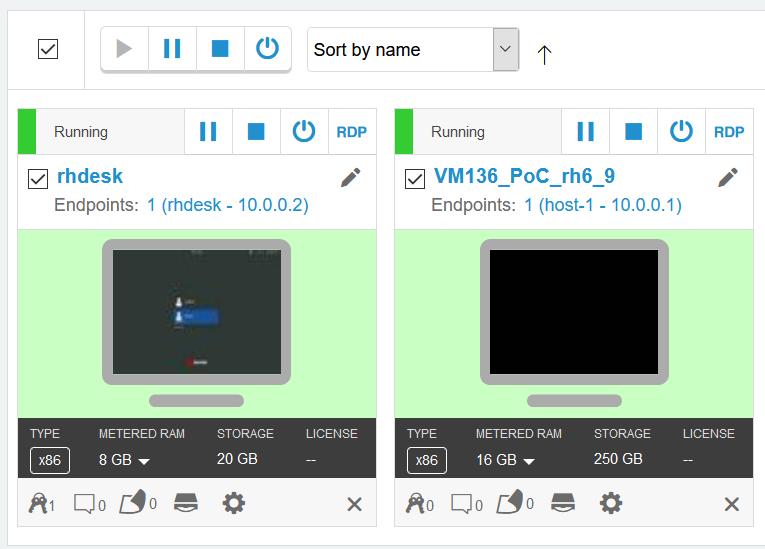

# think-20210-lab-2177
## IBM Cloud Pak for Watson AIOps: Metric Manager

Watson AIOps Metric Manager consume and analyse your metrics or time series data and provides **early warning** of *abnormal behaviour* which might be indicative of potential outage, service degradation or unexpected change. 

It uses AI to dynamically builds thresholds and baselines without need for configuration, so you do not need to keep adjusting the baseline like you did in a traditional Performance Manager system.
Watson AIOps Metric Manager evaluates based on normal behaviours of the data, and it can detect anomalous behaviour on KPIs (Key Performance Indicator). Normal behaviour is learned through an initial training period to build an analytics model and constant model retraining as new data loaded thereafter. 

If a KPI is deemed anomalous an alarm is raised. Related alarms are consolidated in a casual group. Alarms can be viewed and action in the Watson AIOps Event Manager. If required you can trigger the runbook automation, available in Event Manager, to resolve your potential issue before it happen.
In Operation, once the metric data is continuously ingested by Metric Manager, as an SRE you will be notified of possible unresolved issues through the consolidated alerts generated by Metric Manager. 
Here is a diagram on Watson AIOps Metric Manager.

### Lab setup.

To start the lab, if you have not done so, access the image.  If it has not been started, starts both the `rhdesk` and `VM136_PoC_rh6_9` images. You start the image by clicking on the `play` symbol above on the image, either the play symbol at the top to start both images, or click the one above the images. 

Similar to other Watson AIOps Lab exercise you will be working in the __rhdesk__ images.
Once both images are running, click on the _rhdesk_ image and start your web sessions.

Login as ibmuser by clicking on the name, and the password is `engageibm!`

### Lab Exercises
Watson AIOps Metric Manager learns the behavior of the metrics that it ingests. To allow you to see the results in this lab, we have replicated a selected data stream from another system and feed it to the CP4WA-MM data mediation process.  The date range of the data feed is from the 1st of April 2021 00:00 AM to the 25th of April 2:55 PM. The data is coming in 5 minutes intervals. CP4WA-MM processed the data, as they come, near real-time. Therefore, the lab simulates what the user will see on the 25th of April 2021 at 3:00 PM.

The data comes from a performance manager in a data center.  Data includes application and infrastructure performance data.
The data comes every 5 minutes.  Metric Manager processed related data in a topic. A [reference](./ref/) section had been included to explain the term used. In this lab, the topic is THINK21.

MM generates an alert when it detects abnormal behavior that might indicate a potential problem. 

A typical use of MM is to observe and act on the generated alerts.  These alerts can be pushed to the rest of Watson AIOps and create stories and Chatops notifications.  We will be looking only at alerts and MM interfaces.

We will start the first exercise by giving you an overview of the generated anomaly.

There should already be a bookmark labeled "IBM Dashboard Application" on the firefox Bookmark toolbar area.

### [Use Case 1:](./uc1/)

### [Use Case 2:](./uc2/)

### [Use Case 3:](./uc3/)

### [Use Case 4:](./uc4/)

### [Mediation](./mediation/)

### [Reference](./ref/)

#### [Next >](./uc1/)