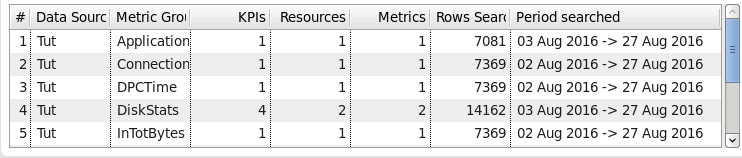

# THINK 2021, Lab:2177
## Build Intelligent IT Operation with IBM Cloud Pak for Watson AIOps
## Metric Manager
### Mediation

Metric Manager can ingest data from 4 generic sources:
-	Kafka 
-	REST Interface
-	Files, for example CSV files.
-	JDBC.

For Cloud environment either Kafka or REST are much more common.  Files and JDBC are used mostly on the more traditional on-premise environment.
Using these common integration types, to speed up connecting Metric Manager to your Performance Manager application, mediation packs has been created both by IBM and the communities.  The following list some of the mediation packs: 

•	AppDynamics
•	Aternity
•	AWS Cloudwatch
•	BMC TSIM
•	CA 
•	Cisco Prime 
•	DC RUM
•	Dynatrace
•	ExtraHop
•	IBM Integration Bus
•	IBM Performance Management
•	IBM Spectrum Control
•	Juniper Networks Cloud Analytics Engine
•	Logstash
•	MF (HP) APM
•	Microsoft Azure
•	Microsoft SCOM
•	Nagios XI Mediation Pack
•	NetIQ AppManager
•	Network Manager (ITNM)
•	Network Node Manager i
•	New Relic
•	Omegamon
•	Oracle OEM
•	Pivotal Cloud Foundry
•	SAP Hana
•	Solarwinds
•	Splunk
•	Statseeker
•	VMware vCenter
•	Zabbix

The latest list and more detail of the mediation packs can be found in IBM documentation (https://www.ibm.com/docs/en/oapi/1.3.6?topic=resources-mediation-packs ).

Some of the key concept and terminology for Metric Manager are listed near the end of this document.

