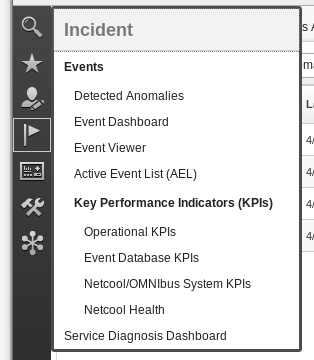
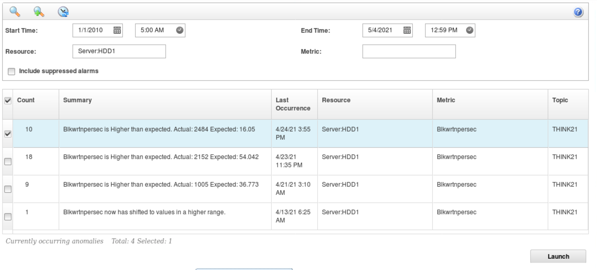
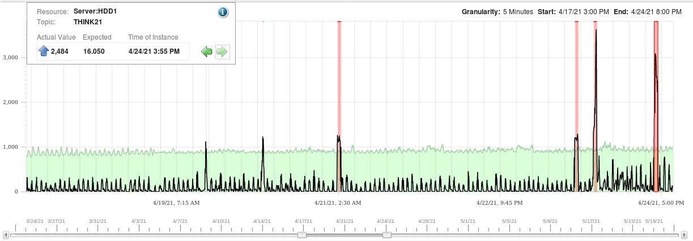
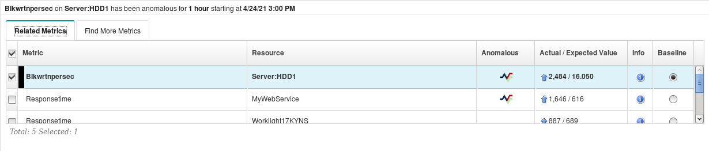
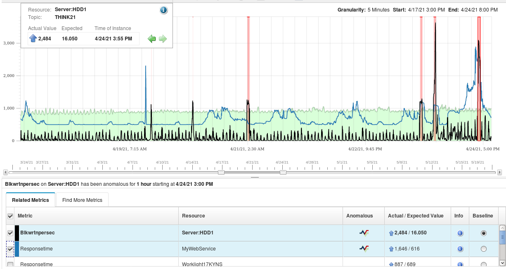
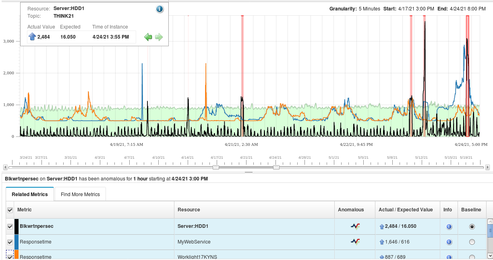
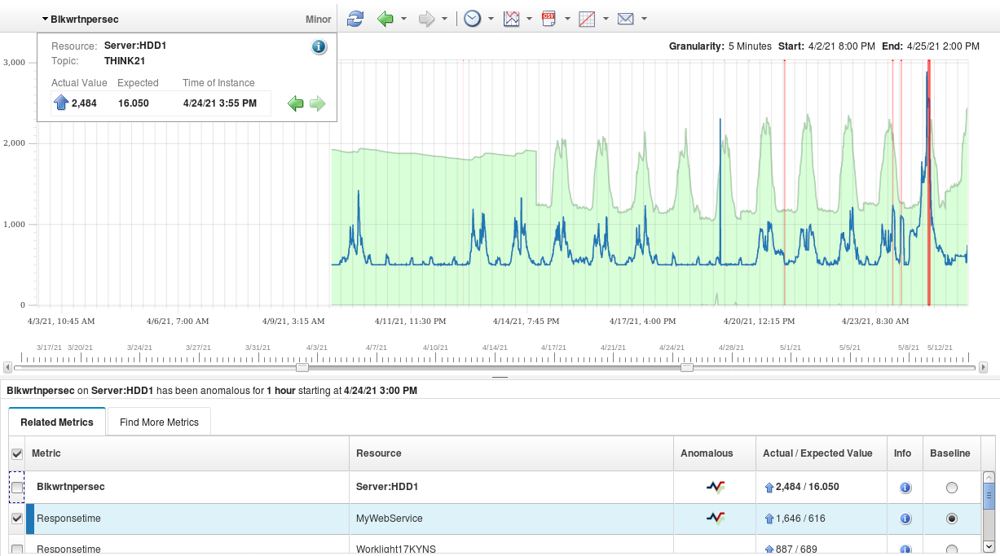

# THINK 2021, Lab:2177.
## Build Intelligent IT Operation with IBM Cloud Pak for Watson AIOps.
## Metric Manager.
### Use Case 1: Anomaly Dashboard and Causal Group.

#### Causal Group
This use case highlights Metric Manager capabilities in creating a causal group: a group of KPIs that relate to each other. It is useful in operation, as when there is a potential issue, you may want to know other factors or events related to or caused by the issue.  This is an area where all SREs want to know to resolve the potential problem quickly.

#### Metric Manager Anomaly Dashboard

You start this lab exercise by already logged in as user `ncoadmin` in the integrated Event Manager and Metric Manager user interface.
From the dashboard, click the incident menu (it looks like a flag).

 

There are three menu options related to Metric Manager: 

- Detected Anomalies
- MetricManagerMediation
- Service Diagnostic Dashboard.

For now, select the "Service Diagnostic Dashboard."

 

You will see an overview of the detected anomalies in the system. There will be four widgets available:

- Anomalies By Hour.
- Top 10 Anomalous Nodes.
- Top 10 Anomalous Resource.
- Top 10 Anomalous Metrics.

Observe by:
- Spend a few minutes observing the dashboard.
- Hover your mouse on the shapes and histogram, and notice the information popup.
- Notice the Topic Name THINK21 in the data. Metric Manager analyzes the relationship between KPIs (resources and metrics} in the same topic. 

We want to look at the resources in our data set that produces the most events. `Server:HDD1` has the biggest circle, with event counts of 4. Let us look at the resource that produces the most anomaly. Click on the biggest circle in the __Top 10 Anomalous Resources__, and you will see the list of the four groups.

 

The metric `Blkwtrnpersec` comes from the original performance data. It is derived from the `Blocks Written Per Second` attribute of the Linux Disk IO data set (`Disk IO.Blk wrtn per sec`).

Select the first row and click Launch.

 

#### Causal Group.

In the first upper portion 
An event will be generated per the red area of the graph.
Observe by:
- Click the arrow in the box, and you can see the values of the metrics value threshold violation.
- This can also be achieved by hovering your mouse on the graph inside the red area.

Look at the bottom section of the page.

Metric Manager as part of its algorithm perform __causal group__ ( See the [reference](../ref/) section). Note the term _causal_; one metric may __cause__ the other, not casual as in casual shirt. This section shows the causal group of the chosen KPI (Resource: `Server HDD1`, Metric: `Blkwrtnpersec`) for this page (the one you choose from the previous four rows table.)

Observe that:
- Metric Manager suggests that the `Responsetime` of `MyWebService` and the `Responsetime` of my application `Worklight17KYNS` are related or affected by the performance degradation of `Blkwrtnpersec` of `Server:HDD1`. Note Metric Manager derived this relationship just based on the ingested data alone. There is no configuration or relationship definition required.
- `MyWebService` also produced anomalies. It is indicated by the small diagram under the `Anomalous` column.
- `Worklight17KYNS`, while in the same causal group, does not independently produce anomaly.

Now let us see the performance data of `MyWebService` resource compare to `Server:HDD1`. Select the `Responsetime` tick box.

 

Observe that:
- the performance graph of the two KPIs differs. However, they have similar spikes.

Note in the screen capture above, the server hard disk metrics are displayed in black and the Web Service response time in blue (the color shown on your screen might be different). If you are examining through eyeball thousands of metrics graphs, it isn't easy to see their relationship. Metric Manager helps you by finding the connection.

To add to the view of the application performance data, select the `Responsetime` of `Worklight17KYNS`.

 

We can see how Metric Manager is suggesting that the 3 KPIs are related.
Observe that:
- The application graph (orange in the screen capture) have earlier spikes in addition to the related spikes.

#### Baseline.

Now, let us look at how Metric Manager builds the confidence (baseline) in the data.

The green areas show the baseline that Metric Manager maintains to compare the metrics for violation.
Deselect all other Metric, and leave `Responsetime` of `MyWebService` selected. Then zoom out the time displayed by clicking and dragging on the time slider on the bottom left of the graph until you see something like the following:

 

Observe that:

- In the beginning, the metric manager does not have enough data to determine the detailed baseline, and the shape is very wide.
- As the metric manager learns data, the baseline becomes more `shapely`. The baseline creates a tighter contour to determine the anomalous behaviors.

#### [<Prev](../)                                         [Next >](../uc2/)
