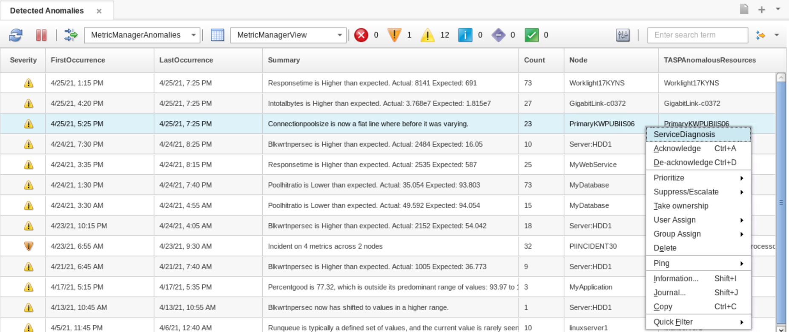

# THINK 2021, Lab:2177
## Build Intelligent IT Operation with IBM Cloud Pak for Watson AIOps
## Metric Manager
### Use Case 2: Flat line causing Slow Response Time

#### Metric Manager Anomaly Alarms

The usual way that an Operation center works, is through `Management by Exception`. Basically the SREs is expected to be notified if something goes wrong.  Metric Manager improves this by sending anomaly.  It sends alarms/alerts when something is about to go wrong.  These alerts allows the SREs with `Incident Avoidance` tools, hence improving `Mean time between failure`.

#### Flat line causing Slow Response Time

When a metric normally varies and then stops varying it almost always means something has gone wrong. It's stuck, or something feeding it is stuck or something it's sending to is stuck.  The ability to detect this behaviour is useful. All customers with systems that have limits of some kind – memory on a machine, connections to a database, traffic through a link, flow through a pipe etc. will find this valuable.  Metric Manager allows you to detect the threshold has been met without knowing the actual limit itself.

#### The Scenario
The data for this use case is from a customer when the connections to their database was behaving unexpectedly. The connection pool for the customers application normally grew and shrunk constantly throughout the day as the usage of the system varied but Predictive Insights detected that this behaviour had changed. The application was stuck at the limit of it's resources and this was slowing the performance for users. It gave a clear starting point and root cause for a poor performance issue, which are notoriously difficult to diagnosis.

#### The lab exercise.
Close your current tab from the previous use case.   Click the Flag icon (for incidents) from the menu strip on the right.  Select `Detected Anomalies` menu item.  If you are familiar with Watson AIOps Event Viewer, this is the `Event Viewer` page with the `MetricManagerAnomalies` Filter and `MetricManagerView` View already preselected. 

 

Observe:
- From the top bar you can see that there is 1 `Major` alarms (Orange Exclamation Symbol) and 12 `Minor` alarms (Yellow Exclaimation Symbol).
- The default Severity for the anomaly alerts is `Minor`.
- Check the list for individual anomalies discovered by Predictive Insights.You can see when an anomaly has started and finished occurring in `FirstOccurrence` and `LastOccurrence` columns. `Summary` column describes the anomaly. `Count` shows how many times the anomaly has occurred. Columns like `Node`, `AnomalousResource`, `AnomalousMetric`, `Direction` provide additional information on the anomaly.
- There is one alert with severity `Major`. Major anomalies represent consolidated alarms found by Metric Manager. In the `Summary` column you can see the type of consolidation and how many metrics or nodes are involved.

Select the alert with Summary `Connectionpoolsize is now a flat line where before it was varying` and Node `PrimaryKWPUBIIS06`.

Observe:

- The metric affected is `Connectionpoolsize`. The `summary` tells you that this metric is flat. The direction column says it is `Higher` than expected. Odds are there is so much usage a ceiling of some kind has been hit. If the direction was `Lower` we would suspect that usage had dropped right off and that the service connecting to this was stopped or broken.

Right click on the event, and select __ServiceDiagnosis__ from the pop up menu.

 

You will see the following graph:

 

Observe:

- The behaviour of `Connectionpoolsize` for the last week can be seen.
- The green area is the baseline that indicates thee xpected range of values. 
- The red zone at the right of the chart shows where something unexpected has happened. Here Metric Manager raises an anomaly while the metric value is __inside__ the baseline. Metric Manager does this because the metric normally varies in value but it has now gone completely flat. The monitored system have hit a limit in the maximum number of connections.

We want to zoom on the diagram.  So click on the start diagram anywhere you want to see the start time, and pull to the right, until you passed the red box.  See the following diagram for approximate zoom area:

 

Observe:

- In the zoomed graph, hover your mouse on top of the flat line, and you can see that the metrics has hit the 3,200 `connection pool size`.
- Somewhere in this system the limit for this connection pool has been set to 3200. The system has slowed down because all the connections are in use, so users have to wait for connections to be freed before they get a response. Enough requests have built up so that as soon as any connections are released they are immediately consumed.

 

Look at the bottom part of the page, and you can see the causal group.
Note the `Processortime` and the `Usertime` are in the causal group, with flat line anomaly.
Select the `Usertime` metrics.

 

Observe:

- When the `Connectionpoolsize` hit a limit of 3,200, the User processor time become starved.  This translate to **Slow Response Time**.  The metric Response time in this case is not provided to Metric Manager, however you can make a conclusion that as the system has reached is maximum connection pool size, the service and users that depends on the connection has to wait for the connection to be released; this translate to poor performance.

Summary during the customer interaction on this use case: 

In normal operation the system runs very close to it's limit. That is why the system slows down intermittently and why these slow downs are hard to diagnose. Only a small increase in normal load is required to put the system under pressure. Traditional monitoring will struggle to detect these cases because you would need to find and then apply the exact connection pool configuration for each occurrence of this metric (that's going to be time consuming and expensive). Then you will need to remember to update this threshold every time an application change is made. Predictive Insights finds this case automatically across every single metric – so you are automatically covered for connection poolsize, for memory, for processor usage and many others without any configuration at all.

#### Customer Quotes

_Before Predictive Insights (previous name of Metric Manager), it took 30 minutes to decide what to investigate. Now it takes less than 3 minutes_