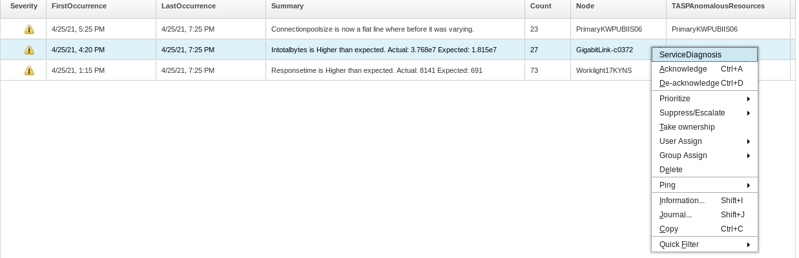
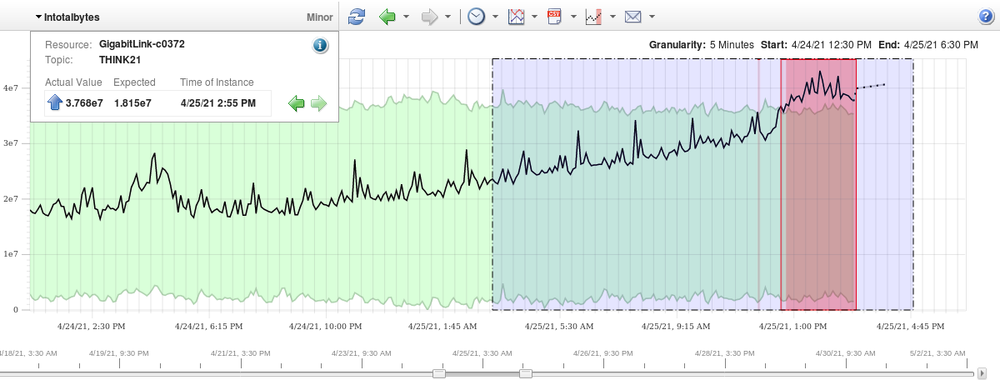

# THINK 2021, Lab:2177.
## Build Intelligent IT Operation with IBM Cloud Pak for Watson AIOps.
## Metric Manager.
### Use Case 3: Dynamic Threshold.

#### Dynamic Threshold.
In this lab, we are looking at the Dynamic Threshold capability of Metric Manager.  We will be looking at data extracted and sanitized from a customer.  The key here is the resource being monitored is still capable of handling the traffic.  In traditional monitoring, most likely, the threshold has not been breached, yet, due to abnormal behavior, Metric Manager allows a pro-active event to be generated.

#### The Customer.
This scenario occurred at a major telecommunications company in the US.

#### The User Case.
Metric Manager alerted a customer that there was much more traffic than usual on many of their network links. These links had sufficient capacity for this new traffic, so any other systems generated no static monitoring events. It was __a denial of service attack__ that they detected before any of their customers were affected.

Any customers with public-facing channels of any kind would typically be interested in this.
Denial-of-service type attacks are often not deliberate or malicious but result from misconfiguration, poor change management, or failures in a system.

#### The lab exercise.
Select the `Detected Anomalies` tab, or close your current tab from the previous use case.

 

Select the `Intotalbytes is Higher than expected. Actual 3.768e7 Expected: 1.815e7` for `GigabitLink-c0372` Node.

Observe:

- The metric affected is `Intotalbytes`. It's more than twice its normal value than is usual at this time of day. 
- We can clearly see the resource being impacted – `GigabitLink-c0372`. This data comes from a customer, and this is a __production__ link the customer care a lot.

Right-click and choose "ServiceDiagnosis..." to launch and do further investigation on the chart.

 

Observe:

- The behavior of InTotalBytes for the last weeks can be seen.
- The green area is the baseline that indicates the expected range of values. 
- The red zone at the right of the chart shows where something unexpected has happened

We can take a closer look at the area of interest by zooming. Click on the chart where we want to start the zoom and drag to cover just past the red area. You always should include some of the chart's "normal" values so you can compare.

 

Observe:

- Typically, metrics have shifting behavior and short-lived natural spikes. The same metric may have very different expected values on different resources. This leads to a one-size-fits-all for static thresholds – too tight, and there are many events, which end up being ignored. Too loose, and problems are not found until users are impacted. 
- In this case, the link in question can handle this throughput without a problem but will have a problem later if it keeps growing. 
- If it stops growing, the system is still showing far more capacity usage than it's really using, potentially leading to wastefulness and unnecessary upgrades.

#### Customer Value.

- Dynamic thresholds and eventing on every metric in your system without any configuration.
- Early detection of emerging problems so that action can be taken before the users are impacted.
- Single place where every metric from every data source can be visualised together with its normal behavior.

#### Customer Quotes.

- "_IBM was able to detect 100% of the major incidents that occurred, including silent failures and predicting outages where possible; showing an annual saving of ~300k and product payback period of 5 months._"

#### [<Prev](../uc3)                                         [Next>](../uc4)
