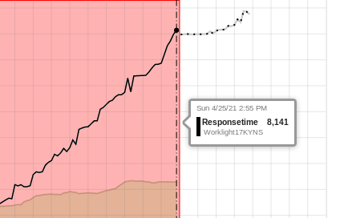

# THINK 2021, Lab:2177
## Build Intelligent IT Operation with IBM Cloud Pak for Watson AIOps
## Metric Manager
### Use Case 3 Forecast:

#### The Customer
This scenario occurred at a major telecommunications company in the US

#### The User Case
Metric Manger alerted a customer that there was much more traffic than usual on many of their network links. These links had sufficient capacity for this new traffic so no static monitoring alarms were generated by any of their other systems. It was __a denial of service attack__ that they detected before any of their customers were affected.

Any customers with public facing channels of any kind would normally be interested in this.
Denial of service type attacks are often not deliberate or malicious but result from misconfiguration, poor change management or failures in a system.

#### The lab exercise.
Select the `Detected Anomalies` tab, or close your current tab from the previous use case.   

 

Select the `Intotalbytes is Higher than expected. Actual 3.768e7 Expected: 1.815e7` for `GigabitLink-c0372` Node.

Observe:

- The metric affected is `Intotalbytes`. It's more than twice its normal value than is usual at this time of day. 
- We can clearly see the resource being impacted – `GigabitLink-c0372`. This data comes from a customer, and this is a __production__ link the customer care a lot.

Right click and choose ServiceDiagnosis... to launch and do further investigation on the chart.

 

Observe:

- The behaviour of InTotalBytes for the last weeks can be seen.
- The green area is the baseline that indicates the expected range of values. 
- The red zone at the right of the chart shows where something unexpected has happened

 

 

 

 

 

#### [<Prev](../uc3)                                         [Back ^](../)