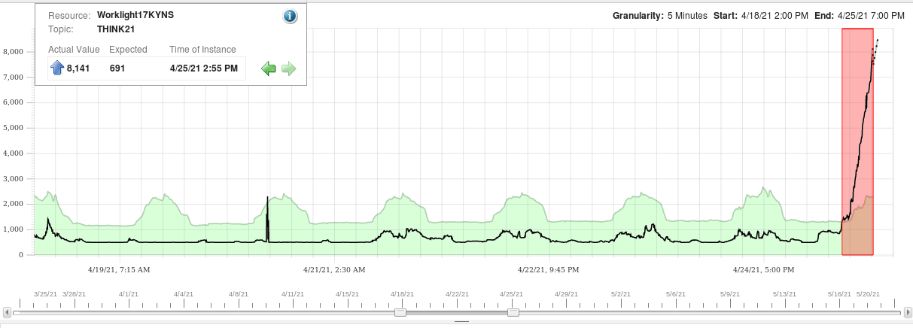
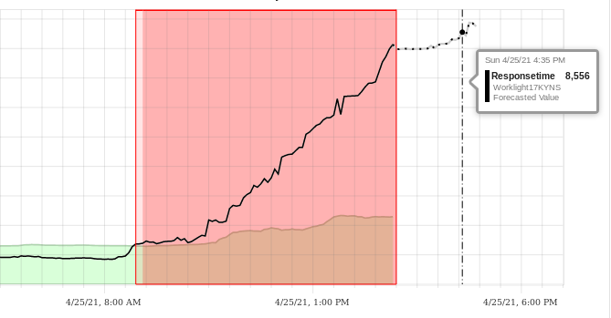

### Forecast

  This use case is similar to the previous use case. There is a sudden increase (or decrease) in the value of the metrics. Metric Manager can perform non-linear forecasting based on the previous value of the metrics. It can then alerts the user based on the forecast value before the increase or decrease of metrics becomes a problem.

### The Scenario

  Metric Manager alerts a customer to an issue with a Response Time metric. On opening the anomaly, a forecast of the metric is provided. From this point, the user knows if the problem needs to be addressed immediately or not.

### The lab exercise

  Select the `Responsetime is Higher than expected. Actual: 8141 Expected: 691` for the Node `Worklight17KYNS` and select __ServiceDiagnosis__.

  

  Observe:
  - This is the response time of an application _Worklight17KYNS_.
  - The behavior of Responsetime for the last week can be seen. It is clearly growing sharply in the anomalous area.

  Zoom on the red area.

  

  Select `Forecast Metrics` from the icons, as can be seen in the screenshot.

  

  Observe:

  - The forecast graph change to reflect the learned data for that metric, from a straight line before to a more irregular shape reflecting the forecasted metrics.
  - Hover your mouse to the last metrics on the red area. It shows the timestamp at 2:55 PM. As mentioned at the beginning of this lab, the last data feed timestamp into Metric Manager was 4/25/21 at 2:55 PM.  Metric Manager monitors the data near real-time.
  
  Hover the mouse on the forecasted metric until you are above 8,500 values.

  

  For the purpose of this lab, let us say that you have set the threshold at 8,500 milliseconds, or 8.5 seconds. (The customer from where this data is extracted actually sets the threshold at 9 seconds).  The threshold will be breached at 4:35 PM.  Metric Manager manages to alert the user before this value being reached, allowing the customer an __Early Detection__ of the potential problem.
